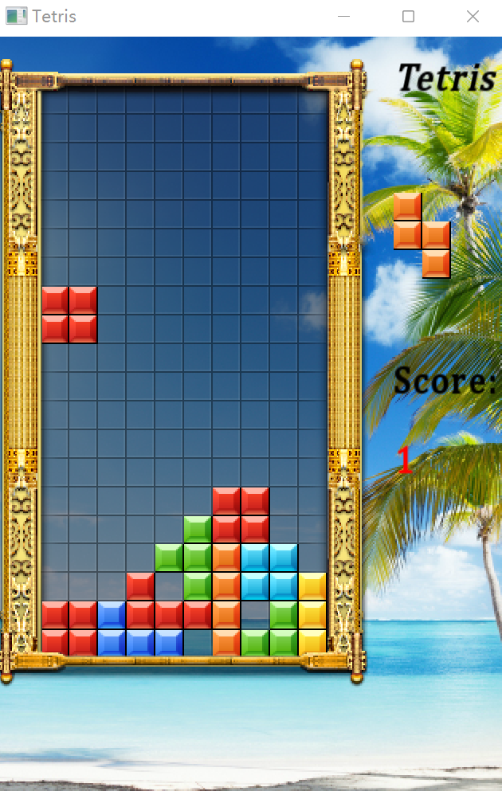

# Tetris 俄罗斯方块小游戏

---

## 1. 信息

- 人工智能与计算机学院(系)
- 班级: 计科2102
- 学号: 1033210212
- 姓名: 夏凡
- 指导老师: 董洪伟

---

## 2. 控制

- A / 方向键左 左
- D / 方向键右 右
- W / 方向键上 旋转
- S / 方向键下 快速落下

## 3. 介绍

本游戏基于：`SFML`  
主要包括库：`sfml-system` , `sfml-window` , `sfml-graphics`  
素材和游戏构想来自互联网，具体源头不得知，基本框架，函数均是重写的。  
（原本框架是单文件，没有函数化，我用class，stl重写，并且完善游戏内容）  
基本游戏内容已经完善：

- 画面与方块
- 随机颜色形状
- 侧边栏
- 计数和下一个方块

---

## 4. 每个文件单独介绍
- [main](./docs/main.md) 这是主要文件，包括主函数，读入游戏资源
- [basic](./docs/basic.md) 随机数生成器
- [game](./docs/game.md) 这是主要游戏文件，包括所有游戏数据和算法

## 5. [讲解视频链接](https://www.bilibili.com/video/BV1zL4y1N7q9)

---

## 6. 本地 build 方法

1. 准备 sfml 库，推荐使用 [vcpkg](https://vcpkg.io) 进行下载 
> `vcpkg install sfml:x64-windows`
1. 修改 CMakeLists 中 vcpkg path
2. cmake 构建，编译
